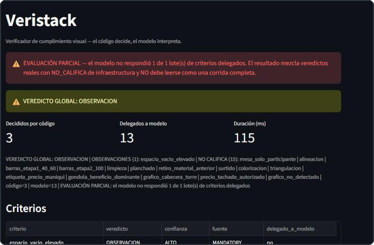
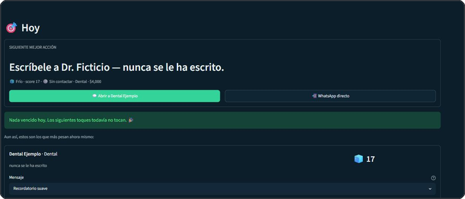
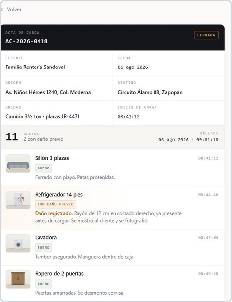
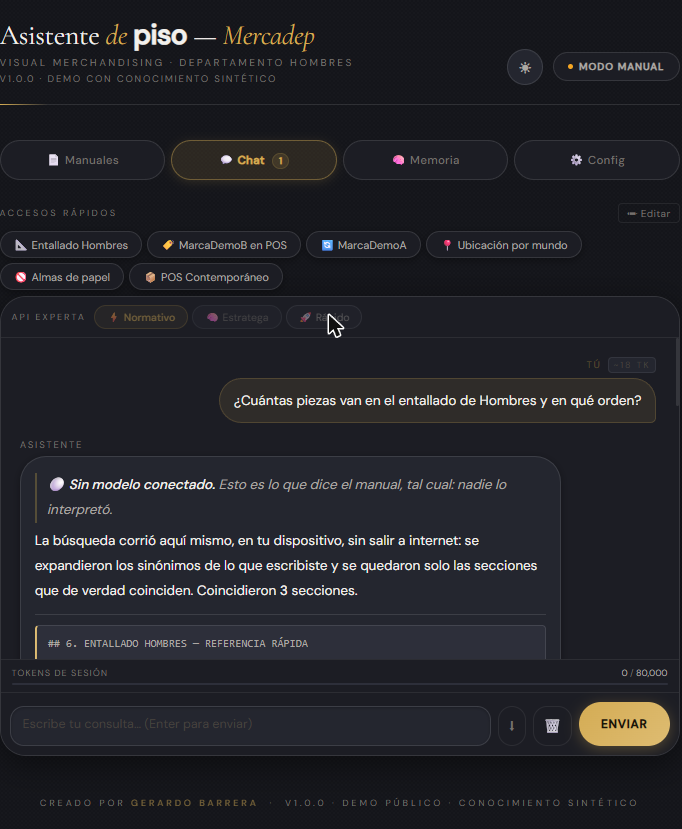
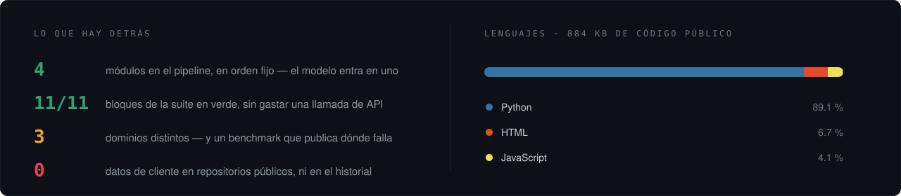

<picture>
  <source media="(prefers-color-scheme: dark)" srcset="assets/banner-hero-dark.svg">
  <source media="(prefers-color-scheme: light)" srcset="assets/banner-hero-light.svg">
  
</picture>

<p align="center">
  
</p>

<p align="center">
  <a href="https://www.linkedin.com/in/gerardo-barrera-dev/"></a>
  <a href="mailto:elyisuswtfgg@gmail.com"></a>
  
</p>

<p align="center">
  
  
  
  
  
  
  
  
</p>


## Qué construyo

Software que **verifica** y que es capaz de decir *no sé*.

Casi toda herramienta que le mete un modelo a un proceso de negocio comparte el mismo
defecto: cuando le falta información, la rellena. Lo que yo construyo hace lo contrario —
el código decide lo que es decidible, el modelo solo interpreta lo que se le delegó, y
cuando no hay evidencia suficiente el sistema **lo declara** en vez de adivinarlo.

Lo probé primero en retail porque ahí trabajé tres años y conocía el problema a pie. Pero
el motor no sabe de retail: sabe de **reglas, evidencia, severidad y trazabilidad**. Los
proyectos de abajo cruzan retail, ventas y logística con la misma columna vertebral.

Estudio Ingeniería en Software y Redes. Escribo mis commits en español.


## En qué se ve

<table>
<tr>
<td width="52%">
  <a href="https://github.com/GERARDOBR01/veristack"></a>
</td>
<td valign="top">

### 🔍 [Veristack](https://github.com/GERARDOBR01/veristack)

**Retail · verificación de exhibiciones**

Foto de evidencia + mecánica de la tarea → veredicto con criterio trazable.

Pipeline determinista de 4 módulos; el modelo entra en **un solo paso** y solo sobre lo
que el código marcó como delegable. Cada criterio dice de dónde salió su veredicto.

```
imagen_oscura: GRAVE — brillo=31
(mínimo: 40) — fuente: CODIGO
```

Y se **mide**: matriz de confusión contra un
ground truth sintético, con los casos donde
falla publicados en vez de escondidos.

`Python` · `Streamlit` · `Gemini` · `Pillow`

</td>
</tr>

<tr>
<td width="52%">
  <a href="https://github.com/GERARDOBR01/CRM-CLIENTES-"></a>
</td>
<td valign="top">

### 🎯 [CRM Certeza](https://github.com/GERARDOBR01/CRM-CLIENTES-)

**Ventas · prospección y outreach**

Contesta una sola pregunta: *¿a quién le escribo hoy, qué le digo y por qué?*

Score, pipeline ponderado y un generador de mensajes que arma la frase a partir de datos
estructurados — no de plantillas copiadas. La app **prepara** el mensaje; el envío
siempre lo da una persona.

`Python` · `Streamlit` · `SQLite` · `pandas`

</td>
</tr>

<tr>
<td width="52%">
  <a href="https://gerardobr01.github.io/MUDANZAS-FLASH-/"></a>
</td>
<td valign="top">

### 📋 [Constancia](https://gerardobr01.github.io/MUDANZAS-FLASH-/) · [demo en vivo](https://gerardobr01.github.io/MUDANZAS-FLASH-/)

**Logística · registro de carga**

*Cuando algo se raya, gana quien tiene el registro.*

Deja constancia del estado de cada bulto antes de subirlo al camión, con sello de hora
que corre en vivo. Un solo archivo HTML: sin build, sin backend, sin red. Abre en el
celular en la banqueta, antes de que arranque el camión.

`HTML` · `CSS` · `JavaScript`

</td>
</tr>

<tr>
<td width="52%">
  <a href="https://gerardobr01.github.io/asistente-de-piso/"></a>
</td>
<td valign="top">

### 💬 [Asistente de piso](https://github.com/GERARDOBR01/asistente-de-piso) · [demo en vivo](https://gerardobr01.github.io/asistente-de-piso/)

**Retail · el estándar operativo, consultable**

La otra mitad de Veristack: uno **verifica** el montaje con una foto, este ayuda a montarlo
bien desde el principio.

Sin API key no se calla ni finge: corre el retrieval en el propio teléfono y entrega la
sección del manual **declarando que nadie la interpretó**. Si nada coincide, lo dice.

```
⚪ Sin modelo conectado.
Coincidieron 3 secciones.
```

`HTML` · `JavaScript` · `Gemini` · `OpenAI`

</td>
</tr>
</table>


## Cómo pienso

> 🟢 **El código decide, el modelo interpreta.**
> La IA no vota un `GRAVE`. Las reglas duras las resuelve código determinista, y el modelo
> solo toca lo que el código le entregó explícitamente.

> ⚪ **Declarar la ignorancia es una feature, no un bug.**
> Sin evidencia suficiente, la respuesta correcta es `NO_CALIFICA` **con confianza alta** —
> alta confianza en que no se puede saber. Un `CUMPLE` inventado cuesta más caro que un
> hueco declarado.

> 🟠 **Los casos de fallo son parte de la arquitectura.**
> Cuota agotada, JSON corrupto, respuesta malformada del proveedor, knowledge vacío: cada
> uno tiene su autotest y su degradación declarada. No son sorpresas de producción.

> 🔴 **Reloj suizo, no cohete espacial.**
> Robusto y verificable antes que espectacular. Prefiero un sistema aburrido que nunca
> miente a uno impresionante que a veces sí.

## Cómo trabajo

- **La entrega incluye la mala noticia.** Si algo quedó parcial, el reporte lo dice arriba,
  antes del resultado — no en una nota al pie.
- **Nada de números inventados.** Si no se midió, no se afirma. Se declara qué falta para
  poder medirlo.
- **Los datos del cliente nunca entran al repositorio.** Ni en el working tree ni en el
  historial. Lo público es el motor; el conocimiento real vive fuera del árbol de git.
- **La suite corre completa sin gastar una llamada de API**, porque una prueba que cuesta
  dinero es una prueba que se deja de correr.
- **Publico dónde falla.** El benchmark de Veristack deja en rojo el caso que todavía no
  resuelve bien, con su causa escrita. Un reporte donde todo sale verde casi siempre
  significa que el set de pruebas no aprieta lo suficiente.




<picture>
  <source media="(prefers-color-scheme: dark)" srcset="https://raw.githubusercontent.com/GERARDOBR01/GERARDOBR01/output/snake.svg">
  <source media="(prefers-color-scheme: light)" srcset="https://raw.githubusercontent.com/GERARDOBR01/GERARDOBR01/output/snake-light.svg">
  
</picture>


## Hablemos

Estoy construyendo sistemas de verificación y automatización operativa, y busco mi primer
rol de tiempo completo en desarrollo de software.

Si tienes un proceso donde alguien **revisa cosas a mano** y el criterio se le queda en la
cabeza — eso es exactamente lo que sé convertir en un sistema auditable.

<p align="center">
  <a href="https://www.linkedin.com/in/gerardo-barrera-dev/"></a>
  <a href="mailto:elyisuswtfgg@gmail.com"></a>
</p>

<details>
<summary><b>In English</b></summary>

<br>

I build **verification software that is able to say "I don't know."**

Most tools that put a model inside a business process share one flaw: when information is
missing, they fill the gap. Mine do the opposite — deterministic code decides what is
decidable, the model only interprets what was explicitly delegated to it, and when the
evidence is insufficient the system **declares it** instead of guessing.

I proved it first in retail because I worked three years on the sales floor and knew the
problem first-hand. The engine doesn't know about retail, though: it knows about rules,
evidence, severity and traceability. The three projects above are three different
industries built on the same spine.

Software & Networks Engineering student. Python, Streamlit, SQLite, deterministic
pipelines. Commit messages in Spanish.

</details>

<p align="center"><sub>Gerardo Barrera · Ingeniería de Software y Redes · Sistemas de verificación y automatización operativa · Guadalajara, México</sub></p>
