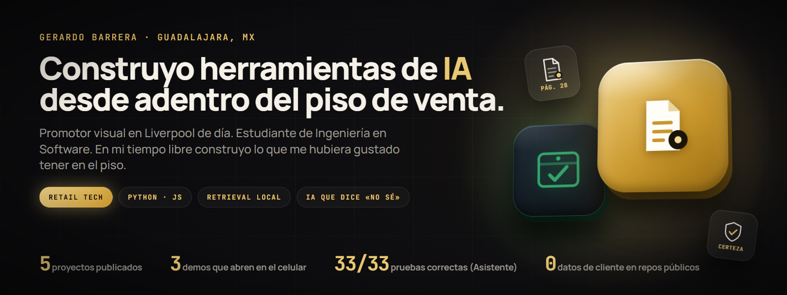
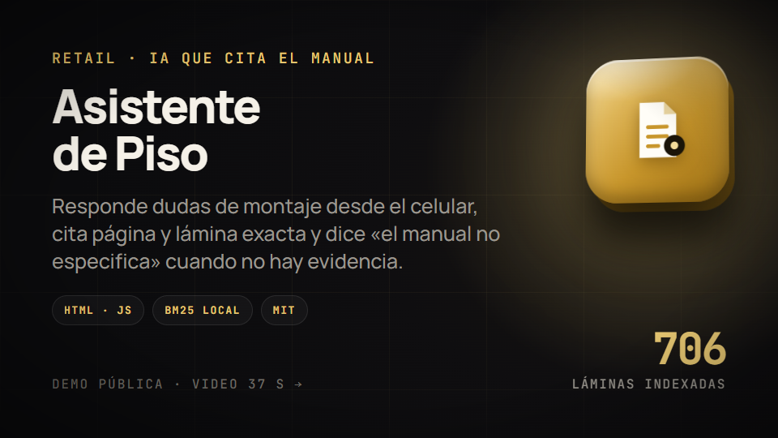
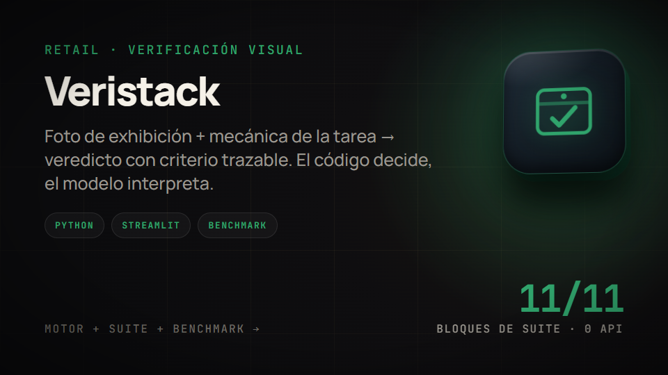
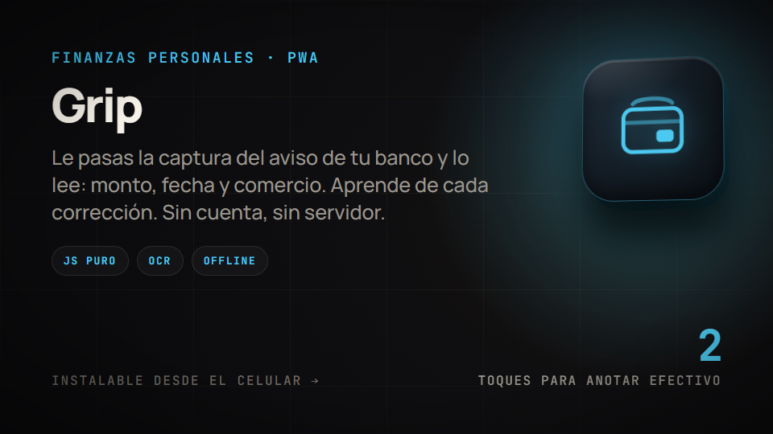
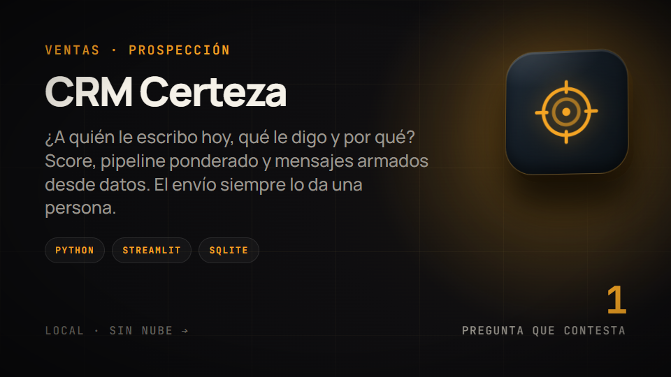
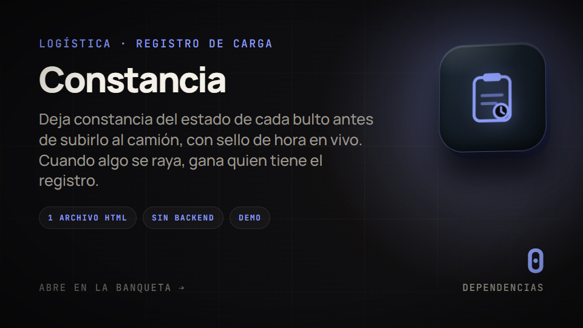
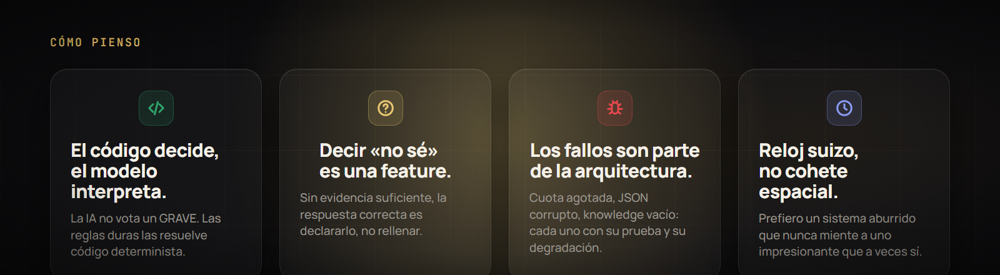
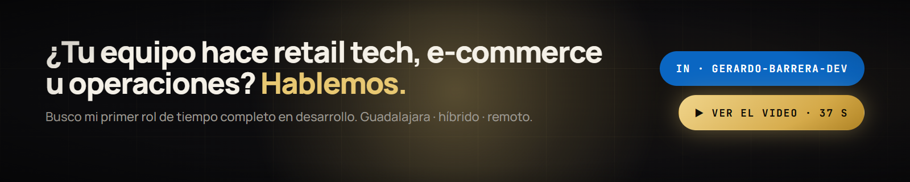

  
  
  

### Hola, soy Gerardo 👋

Trabajo en el piso de venta de **Liverpool** en Guadalajara: promotor visual, responsable de que las exhibiciones
cumplan el manual de campaña (llegué a tener seis secciones a mi cargo, cada una con su propio manual).
Ahí vi dos problemas todos los días — **nadie abre un manual de 40 páginas frente al mueble**, y la
validación de cumplimiento se hace a puro criterio y no queda registrada — y en vez de quejarme los convertí
en software.

Estudio Ingeniería en Software y Redes en la UVM. Antes de Liverpool ensamblé racks y servidores para un
proyecto de Microsoft (vía Foxconn). Construyo en mi tiempo libre, escribo mis commits en español y busco mi
**primer rol de tiempo completo en desarrollo** — retail tech, e-commerce u operaciones, donde lo que sé del
piso valga tanto como lo que sé de código.

## En 37 segundos

  
   
  Motion graphics del proyecto · <a href="https://github.com/GERARDOBR01/Asistente-de-piso/blob/main/docs/video-linkedin.mp4">ver con sonido</a>

## Proyectos

<table>
<tr>
<td width="50%" valign="top">
  
  
<a href="https://github.com/GERARDOBR01/Asistente-de-piso"><b>Repo</b></a> · <a href="https://gerardobr01.github.io/Asistente-de-piso/">Demo en vivo</a> · MIT · 11 manuales · 33/33 pruebas · 1 archivo HTML

</td>
<td width="50%" valign="top">
  
  
<a href="https://github.com/GERARDOBR01/veristack"><b>Repo</b></a> · motor + suite + benchmark con matriz de confusión · conocimiento 100 % sintético

</td>
</tr>
<tr>
<td width="50%" valign="top">
  
  
<a href="https://github.com/GERARDOBR01/Grip"><b>Repo</b></a> · <a href="https://gerardobr01.github.io/grip/">Abrir la app</a> · instalable · funciona sin conexión

</td>
<td width="50%" valign="top">
  
  
<a href="https://github.com/GERARDOBR01/CRM-CLIENTES-"><b>Repo</b></a> · local, sin nube · el envío siempre lo da una persona

</td>
</tr>
<tr>
<td width="50%" valign="top">
  
  
<a href="https://github.com/GERARDOBR01/MUDANZAS-FLASH-"><b>Repo</b></a> · <a href="https://gerardobr01.github.io/MUDANZAS-FLASH-/">Demo en vivo</a> · 0 dependencias

</td>
<td width="50%" valign="top">

**Los dos de retail son una sola idea.**
Asistente de Piso ayuda a **montar bien** (consulta el estándar antes); Veristack **verifica** el montaje
después (foto → veredicto). Misma columna vertebral: *el código decide, el modelo interpreta*.

**Los otros tres** cruzan finanzas personales, ventas y logística con la misma manía: un solo archivo
cuando se puede, cero datos reales en el repo, y una respuesta honesta cuando falta información.

</td>
</tr>
</table>

## Ahora mismo · septiembre 2026

- 📣 Publicando Asistente de Piso en LinkedIn: video, carrusel y la historia de Veristack ([sígueme](https://www.linkedin.com/in/gerardo-barrera-dev/) para verlo).
- 🧪 Veristack ya se mide contra un ground truth sintético; el caso que todavía falla está documentado, no escondido.
- 🤝 Abierto a prácticas o a un primer rol de desarrollo en Guadalajara (presencial, híbrido o remoto).

## Stack

  
  
  
  
  
  
  
  

  
  

<picture>
  <source media="(prefers-color-scheme: dark)" srcset="https://raw.githubusercontent.com/GERARDOBR01/GERARDOBR01/output/snake.svg">
  <source media="(prefers-color-scheme: light)" srcset="https://raw.githubusercontent.com/GERARDOBR01/GERARDOBR01/output/snake-light.svg">
  
</picture>

  
  

<b>In English</b>

 

I build **AI tools from inside the sales floor**. By day I'm a visual merchandiser at Liverpool (Mexico's
largest department store), in charge of making displays match the campaign manual. Two problems I saw every
day became my projects: nobody opens a 40-page manual in front of the fixture, and compliance checks are
done by eye and never recorded.

**Asistente de Piso** answers floor questions from a phone, cites the exact page and slide of the manual,
declares its confidence and says *"the manual doesn't specify"* when there's no evidence — one HTML file,
100 % local retrieval, 11 manuals, 33/33 tests. **Veristack** is the other half: photo of the display →
verdict with a traceable source, where deterministic code decides and the model only interprets what it was
handed.

Software & Networks Engineering student in Guadalajara, looking for a first full-time developer role
(retail tech, e-commerce or operations; on-site, hybrid or remote). Commit messages in Spanish.

Gerardo Barrera · Ingeniería en Software y Redes · retail execution → retail tech · Guadalajara, México

